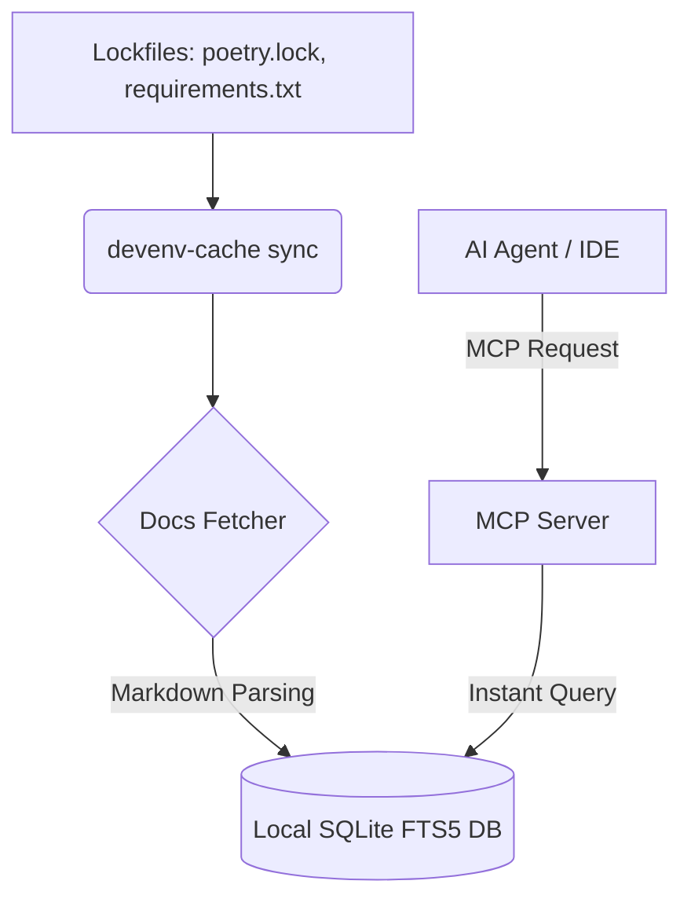

# DevEnv-Cache 🚀

> **AI-Native Local Dependency and Documentation Context Cache via Model Context Protocol (MCP)**
> 
> *Built with help from **Antigravity**, Google DeepMind's agentic AI coding assistant.*

`DevEnv-Cache` is a lightweight, zero-dependency developer tool designed to bridge the gap between AI coding assistants (like Cursor, Claude Code, Copilot, and Antigravity) and your project's local dependencies. It parses project lockfiles, builds a local SQLite full-text search database of package READMEs/APIs, and serves this context offline instantly via an MCP server.

---

## 🔴 The Problem

AI coding assistants are highly capable but suffer from critical friction points when working with external packages:
1. **API Version Hallucinations:** Assistants frequently hallucinate outdated or incorrect API endpoints because their training data is static (e.g., mixing Pydantic V1 and Pydantic V2 signatures).
2. **High Latency & Slow Iteration:** When assistants crawl documentation or perform web searches on the fly to find library details, it takes **1.5 to 5.0 seconds** per query.
3. **Token Pollution:** Scraping full web pages injects thousands of noise tokens (headers, footers, auth links) into the prompt context, raising costs and risking context truncation.
4. **Offline Blockers:** If you are coding on a plane, in a secure sandbox, or have intermittent internet, assistants lose the ability to lookup documentation entirely.

---

## 🟢 The Solution

`DevEnv-Cache` indexes documentation locally, making it accessible to AI agents in under **10 milliseconds** with **zero internet roundtrips**.



---

## 🛠️ How to Use It Effectively

### 1. Installation
Install the CLI tool inside your virtual environment (or globally):
```bash
pip install .
# Or using uv:
uv pip install -e .
```

### 2. Initialize the Cache
Navigate to your Python project's root folder (containing `poetry.lock` or `requirements.txt`) and run:
```bash
devenv-cache init
```
This creates a `.devenv-cache/` configuration directory and sets up the local SQLite database.

### 3. Sync Dependencies
To parse your lockfile and cache the documentation from PyPI:
```bash
devenv-cache sync
```
* **Best Practice:** Run this command whenever you add, remove, or update dependencies in your project (e.g. after running `poetry update` or `pip install`).

### 4. Register the MCP Server
To allow your AI coding assistant to query the cache, register it in your assistant's configuration file (e.g., `mcp_config.json` globally at `~/.gemini/config/mcp_config.json` or your IDE settings):

```json
{
  "mcpServers": {
    "devenv-cache": {
      "command": "devenv-cache",
      "args": ["mcp"]
    }
  }
}
```

---

## 💡 Developer Best Practices: How to Code Effectively

When `DevEnv-Cache` is active, you don't need to change your coding habits or write complex prompts. The system works transparently:

* **Write Prompts Naturally:** Prompt your agent as you normally would: *"Write a custom FastAPI middleware to track custom requests."* 
* **Behind-the-scenes magic:** The AI agent notices `fastapi` in the codebase or prompt, automatically invokes the `devenv-cache` MCP server tools (`search_dependency_docs`), and receives the exact API signatures matching the version installed on your machine.
* **Keep it Offline:** If you go offline, the agent will continue to write perfect imports and method signatures without throwing errors.

---

## 📊 Run Benchmarks & Tests

### Verify Code Integrity
Run the comprehensive test suite to confirm all units (database, cacher, parser, mcp) are fully operational:
```bash
uv run pytest
```

### Run Performance Comparison
To see the comparison report between coding **with** and **without** `DevEnv-Cache`:
```bash
uv run python test_bed/run_benchmark.py
```
Open [docs/benchmark_report.md](file:///Users/mehuljani/agycli/devenv-cache/docs/benchmark_report.md) to inspect the latency differences (e.g. **0.0004s** local SQLite search vs. **0.15s** remote HTTP fetches) and token savings.

---

## 🤖 Built with Antigravity

This repository was designed, built, and tested in partnership with **Antigravity**, Google DeepMind's agentic AI coding assistant. The development process adhered strictly to Test-Driven Development (TDD) protocols, resulting in a clean, zero-dependency implementation of the MCP standard.
