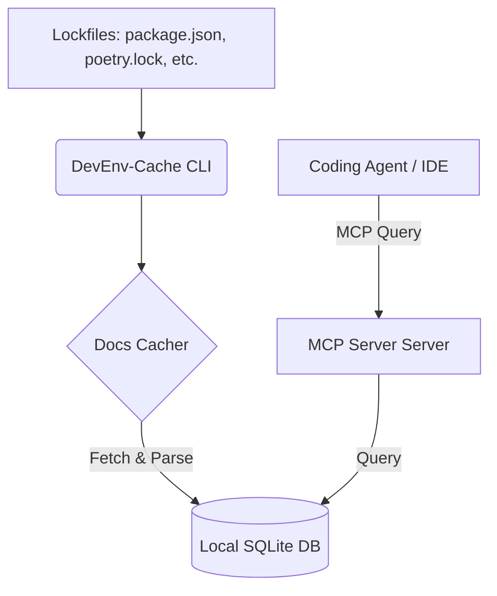

# Product Specification: DevEnv-Cache (AI-Native Dependency & Context Cache)

`DevEnv-Cache` is a developer tool that bridges the gap between coding assistants (like Copilot, Claude Code, Cursor, and Antigravity) and local dependencies. It parses project lockfiles, caches Markdown-formatted API documentation, and serves this context offline to coding agents via a Model Context Protocol (MCP) server.

---

## 🔴 The Core Problem

When coding agents need to write code using external libraries (e.g. `lodash`, `Pydantic`, `pandas`), they struggle with:
1. **Hallucinations:** Using outdated or non-existent API endpoints because their training data is stale.
2. **High Latency:** Fetching documentation via web search engines or scraping public docs during the chat.
3. **Bandwidth & Rate Limits:** Repeating online fetches for the same library across different developer tasks or chat sessions.
4. **Internet Dependency:** Inability to assist when coding offline or in highly secure sandbox environments.

While dependencies exist locally in folders like `node_modules` or `site-packages`, they are optimized for runtime execution (minified code, binaries) rather than being readable or searchable by LLM agents.

---

## 🟢 The Solution: `DevEnv-Cache`

`DevEnv-Cache` acts as a local daemon and an MCP server.



### Key Modules:
1. **Lockfile Watcher & Parser:** Watches `package.json`, `poetry.lock`, `Cargo.lock`, `go.mod`, etc. It extracts the exact dependency list and versions.
2. **Docs Downloader & Markdown Converter:** Resolves dependencies to their package registries (npm, PyPI, Crates.io), pulls down READMEs, API guides, and type definitions, and compiles them into clean, token-efficient Markdown.
3. **Local Semantic DB:** Stores documents locally using SQLite with FTS5 (Full-Text Search) and vector embeddings (optional, for semantic lookup).
4. **MCP Interface:** Exposes standard tools (e.g., `search_dependency_docs`, `get_library_api`, `list_active_dependencies`) that coding agents can call.

---

## 🛠️ User Journey

1. **Setup:** The developer runs `devenv-cache init` in their repository.
2. **Background Sync:** The CLI reads `package.json` (for example), downloads documentation for the dependencies, and indexes them in a local SQLite file (`.devenv-cache/db.sqlite`).
3. **Agent Integration:** The developer registers `devenv-cache` as an MCP server.
4. **Usage:** When the developer prompts their agent: *"Write a script to aggregate data using pandas,"* the agent calls the local `devenv-cache` MCP server, gets the precise API signatures, and writes accurate code instantly.

---

## 🐍 Python Developer Workflow (Detailed Example)

If the target project is a Python project, here is how the end-user installs, configures, and interacts with `DevEnv-Cache`:

### Step 1: Installation & Setup
The developer installs the tool via `pip` (or `uv` / `poetry`):
```bash
pip install devenv-cache
```

In the project root (e.g. where `pyproject.toml`, `poetry.lock`, or `requirements.txt` sits), they run:
```bash
devenv-cache init
```
This generates a local `.devenv-cache/` configuration directory and an empty SQLite index file (`.devenv-cache/docs.sqlite`).

### Step 2: Caching Dependencies
The developer runs the synchronizer to index local dependencies:
```bash
devenv-cache sync
```

**Under the Hood:**
* It auto-detects `poetry.lock` and parses all installed packages and their versions (e.g., `fastapi==0.110.0`, `pydantic==2.6.4`).
* For each library, it downloads its metadata, docstrings, and READMEs from PyPI or local virtual environment packages (`site-packages`), clean-parses them to Markdown, and writes them into `.devenv-cache/docs.sqlite`.

### Step 3: MCP Server Registration
To connect `DevEnv-Cache` to their AI assistant (e.g. VS Code Copilot, Cursor, Claude Code, or Antigravity), the developer registers it as an MCP server in their global `mcp_config.json`:
```json
{
  "mcpServers": {
    "devenv-cache": {
      "command": "devenv-cache",
      "args": ["mcp"]
    }
  }
}
```

### Step 4: Assistant Interaction (Developer Prompt)
Once configured, the developer doesn't need to manually interact with the tool. Interaction happens behind-the-scenes between the AI Agent and the MCP server.

**Example Conversation Flow:**
* **Developer Prompt:** *"Write a custom FastAPI middleware that logs incoming requests using structlog."*
* **AI Agent Action:** The agent identifies `fastapi` and `structlog` as imports. It calls the local `devenv-cache` MCP server:
  * Tool call: `search_docs(query="FastAPI custom middleware class structlog config")`
* **MCP Response:** The local server queries SQLite and returns the exact class structure for FastAPI middleware and configuration snippets for `structlog` corresponding to the versions installed in this specific environment.
* **Result:** The AI agent writes 100% correct code without hallucinating outdated middleware signatures or requiring a web search.

---

## 📐 Architecture & Tech Stack Options

### Option A: Python (Fast Prototype, AI Friendly)
* **Pros:** Rich ecosystem for parsing, Markdown generation, and vector indexing (e.g., SQLite-vec or standard sqlite3). Easy integration with existing science/web plugins.
* **Cons:** Slower startup time, larger binary footprint, requires a Python environment.

### Option B: Go (Lightweight, Highly Portable)
* **Pros:** Compile-to-single-binary. Extremely fast execution, zero dependencies on target systems. Perfect for running inside thin Docker containers or dev containers.
* **Cons:** Writing parsers and HTTP collectors takes a bit more boilerplate code.

---

## 🎯 MVP Roadmap (Phase 1)

1. **Step 1: Node.js/npm Parser:** Support parsing `package-lock.json` and downloading package READMEs/docs from npm.
2. **Step 2: SQLite Storage:** Write a schema to store document text and enable simple keyword/full-text search.
3. **Step 3: Stdio MCP Server:** Expose a single tool `get_package_docs(name)` and `search_docs(query)`.
4. **Step 4: Dev Container Integration:** Add a `.devcontainer` post-create script that spins it up automatically.
